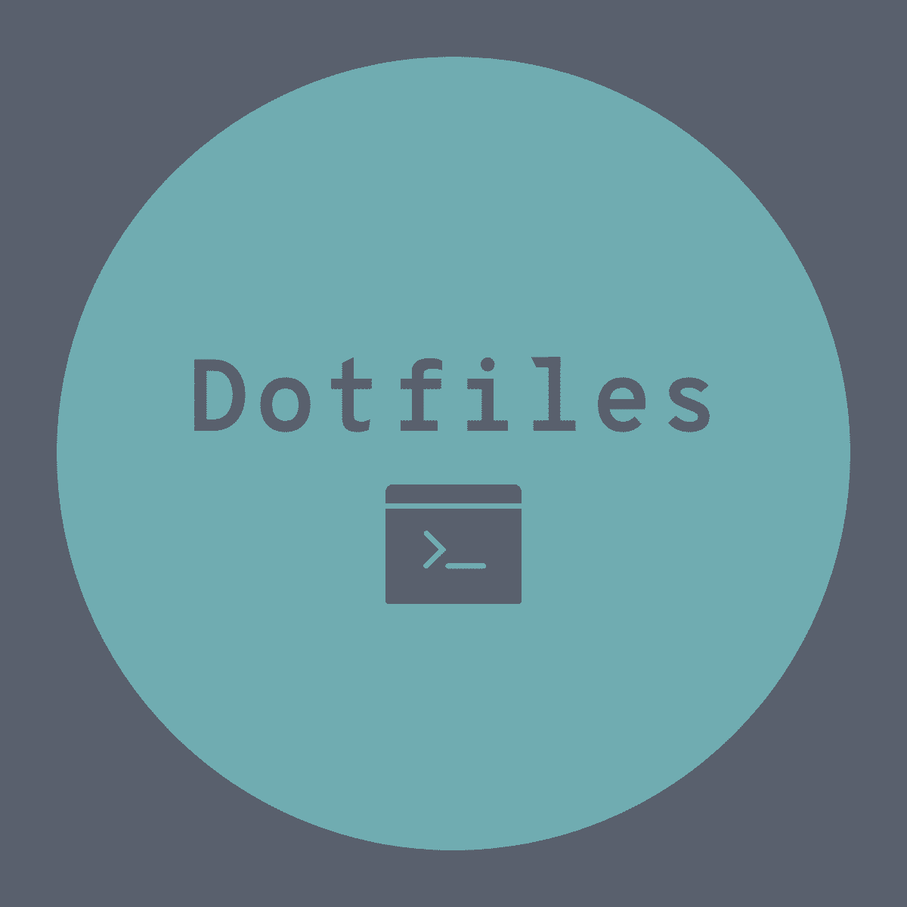

<br>
<br>
<br>
<br>
<p align="center">
  
</p>

<h1 align="center">Dotfiles</h1>

<div align="center"><p>


<br>


</div>

## General

自分が普段使用しているArch Linux(EndeavourOS)のDotFilesを公開しています。

使い慣れたカスタム設定やエイリアス、ツールの設定などが含まれております。自由にカスタマイズしてみてください。

### Configuration
|                            | Configuration                                                                         |
|----------------------------|:-------------------------------------------------------------------------------------:|
| **OS**                     | Arch Linux([EndeavourOS](https://endeavouros.com/))                                   |
| **Window manager**         | [i3](https://i3wm.org/)                                                               |
| **Shell**                  | [Zsh](https://zsh.org/)                                                               |
| **Terminal**               | [Alacritty](https://alacritty.org/)                                                   |
| **Text editor**            | [Neovim](https://neovim.io/)                                                          |
| **Input method framework** | [Fcitx5](https://github.com/fcitx/fcitx5) with [Mozc](https://www.google.co.jp/ime/)  |
| **Browser**                | [Brave](https://brave.com/ja/)                                                        |
| **File manager**           | [Thunar](https://docs.xfce.org/xfce/thunar/start)                                     |
| **Mailer**                 | [Neomutt](https://neomutt.org/)                                                       |
| **Languages**              | ja_JP                                                                                 |

## i3wm
### Instration
```
ln -s $HOME/dotfiles/i3/ $XDG_CONFIG_HOME/i3/
```
### Usage
整備中
## Zsh
### Instration
```
mkdir -p $HOME/.config/zsh
ln -s $HOME/dotfiles/zsh/.zshenv $HOME/.zshenv
ln -s $HOME/dotfiles/zsh/.zshrc $HOME/.config/zsh/.zshrc
ln -s $HOME/dotfiles/zsh/config $HOME/.config/zsh/config
```
### Usage
整備中
## Neovim
### Instration
```
ln -s $HOME/dotfiles/nvim/ $XDG_CONFIG_HOME/nvim/
```
### Usage
基本的な使い方は`KeymapHelp`で参照することができます。
Telescope(ファイル検索)は`TelescopeHelp`で参照することができます。
ファイルツリー上で<Space> + h入力でファイルツリーの操作方法を表示できます。
## License
[MIT]()
